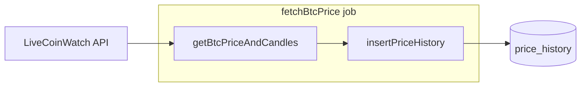

# Swap to LiveCoinWatch API

## Contract to preserve

The rest of the app expects a single function that returns:

- `**currentPrice**`: string (e.g. `"97500"`)
- `**candles**`: array of `{ time, open, high, low, close }` with numeric open/high/low/close and `time` as milliseconds (or value that `new Date(row.time)` accepts)

Only [server/jobs/fetchBtcPrice.js](server/jobs/fetchBtcPrice.js) imports this; [server/db/priceHistory.js](server/db/priceHistory.js) and the API route consume `data.candles` and `data` as above. No other files reference CoinGecko.

## Data flow (unchanged after swap)

## Implementation steps

### 1. Add LiveCoinWatch service

**New file: [server/services/livecoinwatch.js](server/services/livecoinwatch.js)**

- **Base:** `https://api.livecoinwatch.com`, all requests **POST** with `content-type: application/json` and header `**x-api-key: process.env.LIVECOINWATCH_API_KEY`**.
- **Endpoints to call:**
  - **Current price:** `POST /coins/single` with body `{ "currency": "USD", "code": "BTC", "meta": false }`. Response has `**rate`** (number) → use as `currentPrice` (string).
  - **History:** `POST /coins/single/history` with body `{ "currency": "USD", "code": "BTC", "start": startMs, "end": endMs, "meta": true }`. Use e.g. last 24 hours: `end = Date.now()`, `start = end - 24 * 60 * 60 * 1000`. Response has `**history`**: array of `{ date, rate, volume, cap }`.
- **Response mapping:** Map `history` to candles: for each item, `time = date`, `close = rate`, `open = previous item's rate` (or same as close for first), `high = Math.max(open, close)`, `low = Math.min(open, close)`. Return `{ currentPrice: String(rateFromSingle), candles }`.
- **Robustness:** Reuse the same patterns as CoinGecko where useful: a small `fetchWithTimeout(url, ms)` helper with AbortController (15s), and a retry loop (e.g. 3 attempts, 2s delay). For LiveCoinWatch, use `fetch(url, { method: 'POST', headers: { 'content-type': 'application/json', 'x-api-key': apiKey }, body: JSON.stringify(payload), signal })`.
- **Error handling:** Check `res.ok`; if not, throw with status. Parse JSON and, if the API returns an error object (e.g. `body.error` with `code`/`description`), throw a clear Error so logs are useful. If `history` is missing or empty, throw. Do not proceed if `LIVECOINWATCH_API_KEY` is missing (throw or return a clear error).

Implement a single exported function `**getBtcPriceAndCandles()`** with the same signature and return shape as the current CoinGecko implementation so callers do not change beyond the require.

### 2. Wire the job to LiveCoinWatch

**Edit: [server/jobs/fetchBtcPrice.js](server/jobs/fetchBtcPrice.js)**

- Change the require from `../services/coingecko` to `../services/livecoinwatch`.
- No other changes; `fetchAndSaveBtcPrice()` still calls `getBtcPriceAndCandles()` and `insertPriceHistory(data.candles)`.

### 3. Environment and deployment

- **Local:** Add `**LIVECOINWATCH_API_KEY`** to [server/.env](server/.env) (get a free key from [LiveCoinWatch API](https://www.livecoinwatch.com/tools/api)).
- **Render:** In the Web Service’s Environment tab, add `**LIVECOINWATCH_API_KEY`** with the same value so the deployed app can call LiveCoinWatch.
- **.gitignore:** Ensure `.env` remains ignored (no code change if already ignored).

### 4. Optional cleanup

- **Keep or remove [server/services/coingecko.js](server/services/coingecko.js):** Either delete it or leave it in the repo unused. If kept, add a short comment at the top that the app uses LiveCoinWatch and this file is legacy/reference. No other references to update.

## Verification

- Run the server locally with `LIVECOINWATCH_API_KEY` set; hit `GET /api/btc` and confirm 200 and JSON with `currentPrice` and `candles`.
- Trigger the startup fetch and one cron cycle; confirm no "fetchAndSaveBtcPrice failed" and that new rows appear in `price_history`.
- After deploy, set the env var on Render and re-check the deployed `/api/btc` and logs.

## Summary

| Item        | Action                                                                                                                                                              |
| ----------- | ------------------------------------------------------------------------------------------------------------------------------------------------------------------- |
| New service | Add `server/services/livecoinwatch.js` with `getBtcPriceAndCandles()` using LiveCoinWatch POST /coins/single and /coins/single/history, same return shape as today. |
| Job         | In `server/jobs/fetchBtcPrice.js`, require `livecoinwatch` instead of `coingecko`.                                                                                  |
| Env         | Add `LIVECOINWATCH_API_KEY` to `.env` and to Render Web Service env.                                                                                                |
| CoinGecko   | Remove or keep `server/services/coingecko.js`; no other code references.                                                                                            |

